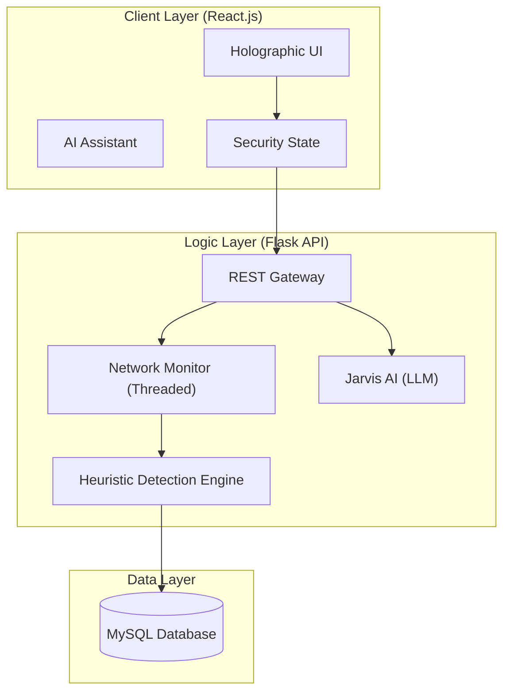

# 🛡️ Network Security & Social Engineering Intelligence Suite

A comprehensive, end-to-end security platform combining real-time network monitoring, heuristic intrusion detection, and AI-driven social engineering awareness.

---

## 🏗️ System Architecture

Our project utilizes a modern **Multi-Tier Distributed Architecture** to ensure scalability and real-time performance.



---

## 🚀 Key Features

### 1. Jarvis AI Security Co-pilot
- **Multimodal Intelligence**: Analyzes server logs, screenshots, and security PDFs.
- **Contextual Guidance**: Provides real-time remediation steps for detected threats.

### 2. Live Network Intrusion Command Center
- **Asynchronous Sniffing**: Passive packet capture using Scapy.
- **Heuristic Engine**: Detects Brute Force, Port Scanning, and DDoS attacks.
- **Automated Blocking**: Integrated IP blacklisting system.

### 3. Social Engineering Defense
- **Phishing Heuristic Scorer**: Analyzes email/message content for deceptive patterns.
- **Awareness Training**: Educational modules to harden the human element of security.

---

## 🛠️ Technology Stack

- **Frontend**: React.js, Lucide Icons, Glassmorphism CSS.
- **Backend**: Python, Flask, Scapy, Threading.
- **Database**: MySQL (Relational Log Storage).
- **AI**: Google Gemini Pro (Multimodal API).

---

## 📥 Installation & Setup

### 1. Prerequisites
- Python 3.9+
- Node.js & npm
- MySQL Server

### 2. Backend Setup
```bash
# Navigate to backend
cd backend

# Create virtual environment
python -m venv venv
source venv/bin/activate  # On Windows: venv\Scripts\activate

# Install dependencies
pip install -r requirements.txt

# Initialize Database
python recreate_db.py

# Run the server
python app.py
```

### 3. Frontend Setup
```bash
# Navigate to frontend
cd frontend/client

# Install dependencies
npm install

# Start the application
npm start
```

---

## ⚠️ Challenges & Problem Solving (Technical Insights)

During development, we navigated complex engineering hurdles. Here is how we resolved them:

### 1. Network Privilege Constraints
- **Problem**: Scapy requires root/administrative privileges to sniff packets.
- **Solution**: We implemented a **Fault-Tolerant Fallback System**. The app attempts a real capture; if it fails, it switches to a **Simulation Engine** so the logic can still be demonstrated.

### 2. Communication & CORS
- **Problem**: Bridging the React frontend and Flask backend.
- **Solution**: Used `flask_cors` for secure cross-origin requests and standardized the API response format.

### 3. Database Integrity
- **Problem**: Managing evolving security log structures.
- **Solution**: Built a centralized `models.py` and `recreate_db.py` to maintain a consistent MySQL schema across all environments.

---

## 👨‍💻 Developed By
**Shakthi & Team**
*Presentation Date: May 2026*
